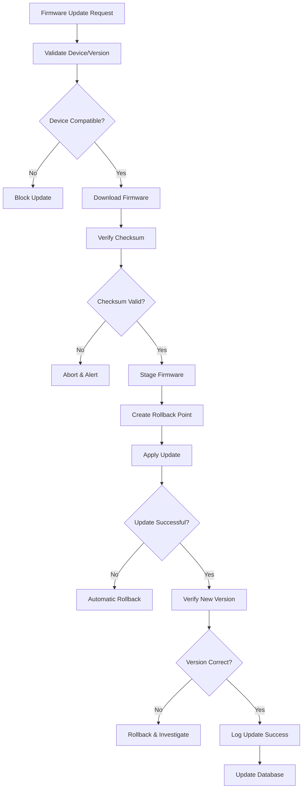

# Firmware Management Guide

## Overview

This document outlines ShadowCypher's firmware management strategy, including sources, update processes, rollback procedures, and vendor-specific workflows. Firmware updates are critical for security, stability, and feature enablement across supported hardware platforms.

## Firmware Sources

### Official Vendor Sources

Firmware is sourced exclusively from official vendor channels to ensure authenticity and security:

| Vendor | Device Classes | Primary Source | Update Frequency | Support Level |
|--------|----------------|----------------|------------------|---------------|
| Intel | CPU Microcode, Storage Controllers | Intel Support Portal | Quarterly | Enterprise |
| AMD | CPU Microcode, AGESA/BIOS | AMD Product Support | Bi-annual | Enterprise |
| Apple | Boot firmware, System software | Apple Security Updates | Monthly | Enterprise |
| ARM | Trusted Firmware | ARM Developer Portal | As-needed | Technical |
| Broadcom | Network/Storage Controllers | Vendor Support Portal | Annual | Standard |
| LSI/Broadcom | RAID Controllers | Avago/Broadcom Support | Annual | Standard |

### Verification Methods

All firmware downloads must be verified:

1. **Checksum Verification**: MD5, SHA-256, or SHA-512 hashes from vendor
2. **GPG Signatures**: When available, verify cryptographic signatures
3. **Certificate Pinning**: HTTPS with certificate verification enabled
4. **Integrity Checks**: Internal hash validation post-download

## Update Process

### Pre-Update Requirements

```
1. Verify system stability (uptime >= 24 hours)
2. Backup critical data (full system snapshot recommended)
3. Review firmware release notes for breaking changes
4. Check firmware database for compatibility issues
5. Schedule maintenance window (no active security operations)
6. Notify relevant stakeholders if production environment
```

### Update Workflow



### Update Staging

Firmware staging creates a safe pre-update state:

1. **Create System Snapshot**: Full filesystem snapshot/backup
2. **Stage Firmware Files**: Copy to temporary staging directory
3. **Validate Stage**: Verify file integrity in staging
4. **Create Recovery Point**: Save boot recovery information
5. **Disable Auto-Updates**: Prevent concurrent updates during process

### Rollback Procedures

Rollback is automatic if update verification fails or can be manually triggered:

#### Automatic Rollback Triggers

- Update verification fails
- New version does not match expected version
- Device fails to boot after update (auto-recovery)
- Critical functionality broken post-update
- System health check fails

#### Manual Rollback

```bash
# Check rollback available versions
./firmware-update.sh --list-rollback-points <device>

# Perform rollback
./firmware-update.sh --rollback <device> <version>

# Verify rollback successful
./firmware-update.sh --verify <device>
```

#### Rollback Validation

1. Boot into recovery mode if needed
2. Verify previous firmware version
3. Run device self-tests
4. Check system logs for errors
5. Validate critical functions

## Vendor-Specific Workflows

### Intel Microcode

**Platform**: x86_64 (Intel processors)

**Update Method**:
- Direct microcode loading (early boot)
- BIOS/UEFI microcode updates
- Linux kernel microcode patches

**Update Frequency**: Quarterly security patches

**Special Considerations**:
- CPU detection required before update
- Some microcode patches disable CPU features for security
- Requires system restart for full effect
- Multiple microcode versions may coexist

**Rollback**: Not recommended without BIOS reset

**Reference**: `firmware-db.json` entries with `vendor: "intel"`

### AMD BIOS/AGESA

**Platform**: x86_64 (AMD processors)

**Update Method**:
- BIOS/UEFI firmware updates
- AGESA (AMD Generic Encapsulated System Architecture)
- Bootloader updates

**Update Frequency**: Bi-annual or security-triggered

**Special Considerations**:
- Motherboard-specific updates
- May require clearing CMOS post-update
- AMD-specific CPU feature flags may change
- Rollback requires previous BIOS binary

**Rollback**: Supported if BIOS binary available

**Reference**: `firmware-db.json` entries with `vendor: "amd"`

### Apple Boot Firmware

**Platform**: ARM64 (Apple Silicon)

**Update Method**:
- Integrated with macOS security updates
- Apple Configurator for fleet deployment
- Mac Recovery environment

**Update Frequency**: Monthly with security updates

**Special Considerations**:
- Firmware bundled with macOS
- Cannot be updated independently
- Requires authenticated boot
- Secure Enclave firmware also updates

**Rollback**: Not independently supported; requires macOS downgrade

**Reference**: `firmware-db.json` entries with `vendor: "apple"`

### Broadcom Network/Storage Controllers

**Platform**: Multi-platform

**Update Method**:
- EEPROM flashing tools
- OEM-supplied firmware images
- Web management interface (for network devices)

**Update Frequency**: Annual or security-critical

**Special Considerations**:
- Model-specific firmware required
- Requires vendor utilities (broadcom-flash-util)
- Network interruption during update
- Some controllers require power-cycle

**Rollback**: Supported with previous EEPROM image

**Reference**: `firmware-db.json` entries with `vendor: "broadcom"`

### LSI/Broadcom RAID Controllers

**Platform**: Multi-platform with RAID arrays

**Update Method**:
- MegaCLI or StorCLI utility
- IPMI interface
- Firmware update mode

**Update Frequency**: Annual or when critical issues identified

**Special Considerations**:
- RAID array access may be blocked during update
- Requires administrator credentials
- Battery Backup Unit (BBU) conditioning may trigger
- Hot-swap not permitted during update

**Rollback**: Supported if previous firmware binary preserved

**Reference**: `firmware-db.json` entries with `vendor: "lsi"` or `"broadcom_raid"`

### ARM Trusted Firmware

**Platform**: ARM64 servers and embedded systems

**Update Method**:
- Bootloader update via vendor tools
- UEFI firmware updates
- Secure boot manifest updates

**Update Frequency**: As-needed for security or feature improvements

**Special Considerations**:
- Platform-specific (cannot cross platforms)
- May require debug build tools
- Secure boot must be validated
- Some systems allow signed firmware only

**Rollback**: Depends on bootloader configuration

**Reference**: `firmware-db.json` entries with `vendor: "arm"`

## Database Schema (firmware-db.json)

### Firmware Record Structure

```json
{
  "firmware_id": "unique-identifier",
  "vendor": "vendor-name",
  "device_type": "cpu|bios|nic|raid|boot|misc",
  "device_model": "device-model-identifier",
  "version": "x.y.z",
  "release_date": "YYYY-MM-DD",
  "download_url": "https://vendor.com/firmware/...",
  "checksum_sha256": "hex-digest",
  "file_size_bytes": 1024000,
  "breaking_changes": ["description1", "description2"],
  "security_fixes": ["CVE-XXXX-XXXXX"],
  "incompatibilities": [
    {
      "device_model": "conflicting-device",
      "reason": "description"
    }
  ],
  "required_prerequisites": ["firmware-id-1", "firmware-id-2"],
  "notes": "Additional implementation notes"
}
```

## Command Reference

### firmware-update.sh

```bash
# Check current firmware versions
./firmware-update.sh --status [device]

# List available updates
./firmware-update.sh --list-updates [device]

# Perform firmware update
./firmware-update.sh --update <device> <version> [--force]

# Verify firmware
./firmware-update.sh --verify <device>

# List rollback points
./firmware-update.sh --list-rollback-points <device>

# Rollback to previous version
./firmware-update.sh --rollback <device> <version>

# Query firmware database
./firmware-update.sh --query <device-model> [--format json|text]

# Validate firmware database
./firmware-update.sh --validate-db

# Show firmware update history
./firmware-update.sh --history [device] [--limit 10]
```

## Best Practices

### Update Planning

1. **Staging Environment First**: Test firmware updates in non-production first
2. **Maintenance Windows**: Schedule updates outside peak operational hours
3. **Backup Strategy**: Maintain full backups before any firmware update
4. **Change Documentation**: Track all firmware changes for compliance
5. **Vendor Support**: Subscribe to vendor security advisories

### Security Considerations

1. **Authenticity**: Always verify firmware digital signatures
2. **Integrity**: Validate checksums before deployment
3. **Authorization**: Restrict firmware update access to security team
4. **Audit Logging**: Log all firmware updates with timestamps
5. **Change Control**: Require approval for production updates

### Monitoring Post-Update

1. **System Health**: Monitor CPU/memory/thermal immediately post-update
2. **Error Logs**: Review system logs for update-related warnings
3. **Performance**: Benchmark performance against baseline
4. **Security Events**: Monitor for anomalous security events
5. **Feature Validation**: Test critical security features after update

## Troubleshooting

### Common Issues

| Issue | Symptom | Resolution |
|-------|---------|-----------|
| Update Fails | Checksum mismatch | Re-download firmware, verify network |
| Boot Failure | No POST after update | Automatic rollback to previous version |
| Version Mismatch | Query shows old version after update | Cold boot system, verify with vendor tools |
| Compatibility Error | Device blocks update | Check firmware-db.json for incompatibilities |
| Rollback Unavailable | Cannot locate previous firmware | Restore from backup, check staging directory |

### Debug Mode

```bash
# Enable debug logging
export FIRMWARE_DEBUG=1
./firmware-update.sh --update <device> <version>

# Dry-run mode (no actual updates)
./firmware-update.sh --update <device> <version> --dry-run
```

## Maintenance

### Regular Tasks

- **Weekly**: Review firmware update notifications from vendors
- **Monthly**: Validate firmware database integrity
- **Quarterly**: Test rollback procedures in staging
- **Semi-annually**: Review and update firmware-db.json with new releases

### Database Updates

The firmware-db.json file is maintained by the security team:

```bash
# Update database entry
./firmware-update.sh --add-entry <json-file>

# Remove deprecated entry
./firmware-update.sh --remove-entry <firmware-id>

# Export records
./firmware-update.sh --export-db > firmware-backup.json
```

## Compliance and Auditing

### Audit Trail

All firmware updates create audit entries containing:
- Device identifier and model
- Old and new firmware versions
- Update timestamp and operator
- Update result (success/failure/rollback)
- Validation results

### Regulatory Alignment

Firmware management procedures align with:
- **NIST SP 800-153**: Guidelines on 3DES Modes of Operation
- **NIST SP 800-161**: Supply Chain Risk Management
- **CIS Controls**: v8 Secure Configuration Management
- **ISO/IEC 27001**: Control 14.2.1 (Security Updates)

## References

- [firmware-update.sh](./firmware-update.sh) - Main update script
- [firmware-db.json](./firmware-db.json) - Firmware database
- [HARDWARE_COMPATIBILITY.md](./HARDWARE_COMPATIBILITY.md) - Hardware requirements
- Intel Microcode Repository: https://www.intel.com/content/www/en/us/design/products/processors/
- AMD BIOS/AGESA: https://www.amd.com/en/support
- Apple Firmware: https://support.apple.com/en-us/HT201541

---

**Last Updated**: 2026-07-05
**Version**: 1.0.0
**Maintainer**: ShadowCypher Security Team
