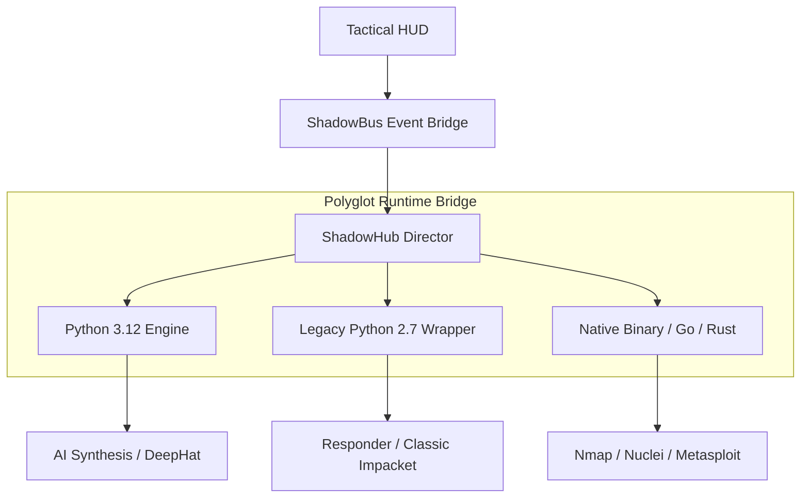

# 🛡️ ShadowCypher: Polyglot Offensive Orchestration Plane


**ShadowCypher** is a high-fidelity offensive security workstation designed to unify modern AI-driven synthesis with a legacy-compatible tactical engine. Unlike unified-version frameworks, ShadowCypher utilizes a **Polyglot Runtime Bridge** to execute thousands of security tools across disparate environments (Python 2.7, Python 3.x, Go, C++, Rust, and Bash) within a single, hardened command plane.

---

## 🏛️ Direct-Link Architecture: The Obsidian Citadel

ShadowCypher circumvents standard virtual machine overhead by utilizing **Direct-Link Native Binders**. This allows the UI to communicate with offensive modules via a high-speed inter-process event bus, zero-cladding execution, and specialized linker optimizations (`mold`).



---

## 🚀 Key Technological Pillars

### 1. Polyglot Runtime Resolution
The platform autonomously detects the mandatory environment for any given tactical script. 
-   **Header Analysis**: Scrapes shebangs and file metadata to determine if a legacy Python 2.7 interpreter or a specific shell context is required.
-   **Zero-Config Execution**: Automatically wraps commands like `Responder.py` with the correct prefix, regardless of the core platform's version.

### 2. High-Fidelity Signal Synthesis
Using the **DeepHat Ultima** engine, ShadowCypher doesn't just run tools—it forges them.
-   **Heuristic Adaptation**: AI-driven analysis of scan data informs the synthesis of mutating stagers and custom EDR bypasses.
-   **Artifact Forging**: Synchronizes with the local signal-pulse to ensure payloads are temporally aligned with target network windows.

### 3. Hardened Sovereign Operations
Security is enforced at the kernel and application layer to ensure absolute operator discretion.
-   **MTLS Engagement**: All internal communications between the UI and sub-processes are signed via HMAC-SHA256.
-   **RSA-4096 Identity**: Administrative elevation is locked behind asymmetric challenge-response handshakes.

---

## 🔧 Offensive Arsenal & Strike Groups

| Strike Group | Logic Engine | Primary Focus |
|--------------|--------------|---------------|
| **SIGINT & Recon** | Native C / Go | Sub-threshold signal discovery and gateway fingerprinting. |
| **Exploit Forge** | DeepHat Synthesis | Autonomous zero-day audit and shellcode mutation. |
| **Identity Strike** | Legacy Python 2.7 | Kerberos spoofing, AD pivoting, and NTLM relaying. |
| **Deployment** | HTTPS / Tunneling | Secure phishing lures and SSL-hardened persistence. |

---

## ⚡ Quick Engagement

### 1. Workstation Preparation
```bash
# Install the Obsidian dependency matrix
sudo apt-get update && sudo apt-get install -y \
    python3-gi python2 gir1.2-gtk-3.0 \
    libcairo2-dev libgtk-3-dev xvfb
```

### 2. Command Plane Ignition
```bash
git clone https://github.com/jakes1345/ShadowCypher.git
cd ShadowCypher
pip install -r requirements.txt
./shadowcypher_launch
```

---

## ⚖️ Operational Mandate

This workstation is a specialized instrument for **authorized research and penetration testing**. Unauthorized engagement of external infrastructure is illegal. The operator holds 100% liability for missions dispatched via the Sovereign Hub.

> **Status**: APEX_STABLE | Deployment Ready | Legacy Support: ACTIVE
