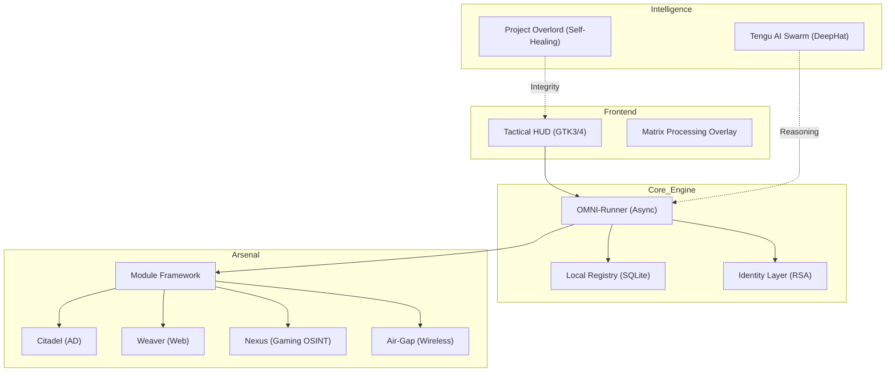

<div align="center">
  
  <h1>S H A D O W C Y P H E R</h1>
  <p><b>Elite Penetration Testing & AI Orchestration Platform [Build V33 OMNI-HEAL]</b></p>
  
  [](https://github.com/jakes1345/ShadowCypher)
  [](https://github.com/jakes1345/ShadowCypher)
  [](https://github.com/jakes1345/ShadowCypher)
  [](https://github.com/jakes1345/ShadowCypher)
</div>

---

## 🛡️ Enterprise-Grade Offensive Intelligence
**ShadowCypher** is a professional-grade, multi-vertical offensive security platform engineered for zero-latency tactical engagement. Built on a hardware-accelerated **Cairo-GTK3/4** foundation, the suite merges manual enumeration with an autonomous Swarm AI protocol (**Tengu AI**) and a self-healing audit engine (**Project Overlord**).

Every line of code and every visual interface has been synthesized under the **Obsidian Glass Black** design philosophy—deep-matte `#010204` styling, cyan pulses, and indestructible thread-safe background processing.

---

## ⚠️ Legal & Ethical Disclaimer

**ShadowCypher is strictly for educational purposes, authorized security auditing, and defensive research.**

The creators, contributors, and maintainers of ShadowCypher assume **NO LIABILITY** for any misuse, damage, or illegal activities conducted with this software. By downloading, installing, or using ShadowCypher, you explicitly agree that:
1. You have explicit, written authorization to scan, test, and interact with the networks and systems you target.
2. You will not use this software for malicious, unauthorized, or illegal activities.
3. You bear full responsibility for your actions and the consequences of utilizing offensive security tooling.

---

## 🏗️ The Architecture: OMNI-HEAL Core

ShadowCypher utilizes a deep-threaded, non-blocking architecture designed to maintain 60FPS UI performance even during heavy payload generation or brute-force operations.



---

## 🦾 Tactical Dashboards (The Arsenal)

ShadowCypher is partitioned into high-fidelity tactical boards, each directly synchronized with native system binaries and specialized modules.

### 🛡️ Autonomous Audit Engine (Project Overlord)
The suite's self-healing heart. Project Overlord runs continuous background audits to ensure UI stability, resource optimization, and security integrity. If a distortion or process failure is detected, the engine autonomously restores the system state.

### 🏰 AD Attacks (The Citadel)
Domain dominance and enterprise-level exploitation.
- **Active Hooks:** Kerberoasting, AS-REP Roasting, Domain Controller enumeration, LDAP reconnaissance, GPO auditing.

### 🕸️ Web Attacks (The Weaver)
High-precision web application vulnerability discovery.
- **Active Hooks:** Automated XSS Probing, SQL Injection automation, Path Traversal discovery, HTTP Request Smuggling tests, API fuzzer integration.

### 🎮 Gaming OSINT (The Nexus)
Cross-platform intelligence gathering across gaming ecosystems.
- **Active Hooks:** Steam Profile Recon, Xbox Live Activity tracking, cross-platform username correlation, achievement-based behavioral profiling.

### 🦾 Tactical Swarm AI (Tengu Core)
Integrates directly with local LLMs (via Ollama or custom model hubs). Use "Active Pulse" to dynamically analyze Nmap outputs, reverse-engineer binaries, or generate custom exploitation vectors.

### 📡 Signal Reconnaissance
The mapping engine. Traces exact paths to targets and generates comprehensive network topographies.
- **Hooks:** Quick Port Scans, UDP Sweeps, OS Detection, Subnet Discovery, Traceroute.

### 💣 Offensive Exploit
Synchronizes with local Metasploit instances to generate tailored backdoors.
- **Hooks:** Remote Reverse Shell Generation, Payload Encoding (x86/shikata_ga_nai), Listener activation, privilege escalation.

### 📶 Wireless Signals (Air-Gap)
WiFi spectrum dominance via `airmon-ng` and `aireplay`.
- **Hooks:** Interface monitor switching, Airodump-ng tracking, Client Deauth, WPA Handshake interception.

---

## 🛠️ Installation & Deployment

ShadowCypher is built for multi-platform mobility. Choose your tactical path below:

### Path A: Native Linux (Ubuntu/Debian/Arch)
```bash
# 1. Clone the repository
git clone https://github.com/jakes1345/ShadowCypher.git && cd ShadowCypher

# 2. Run the tactical installer (Syncs system dependencies)
chmod +x install.sh && sudo ./install.sh

# 3. Launch the OMNI-Build
./run.sh
```

### Path B: Containerized (Docker)
Ensure Docker and Docker Compose are installed.
```bash
# Deploy the container swarm
docker-compose up -d --build
```

### Path C: Windows Subsystem (WSL2)
Execute the deployment script from a PowerShell (Administrator) terminal:
```powershell
.\Deploy-Windows.bat
```

### Path D: System Integration
To install ShadowCypher as a native system application with a desktop icon:
```bash
cd native
sudo ./install.sh
```

---

## 🔒 Security Hardening & Admin Node

- **Trust Model**: Cryptographic challenge-response validates Admin vs. Operator status at startup.
- **Secure Comm-Link**: Tickets are encrypted via RSA-OAEP (SHA-256) locally. Only the Admin possessing the `admin_private.pem` can decrypt them.
- **Sandboxing**: AI Orchestrator uses `execvp` and a strict allowlist to prevent arbitrary command execution.
- **Input Sanitization**: All tactical inputs are scrubbed via `core/sanitize.py` to mitigate injection risks.

---

## 🚀 Mission Operations

1. **Recon**: Build a target profile using **The Signal** and **The Nexus**.
2. **Analysis**: Pivot to **Tengu AI** to autonomously interpret the attack surface.
3. **Exploitation**: Select the payload bay or specialized module (**The Citadel** / **The Weaver**).
4. **Defense**: Activate **The Shield** to obfuscate origin points and lock down the local firewall.
5. **Report**: Export mission artifacts via the **Reporting Engine** (`reports/`).

---

<div align="center">
  <i>"Control the flow of information, and you control the war."</i><br>
  <b>S H A D O W C Y P H E R // O M N I - H E A L</b>
</div>
