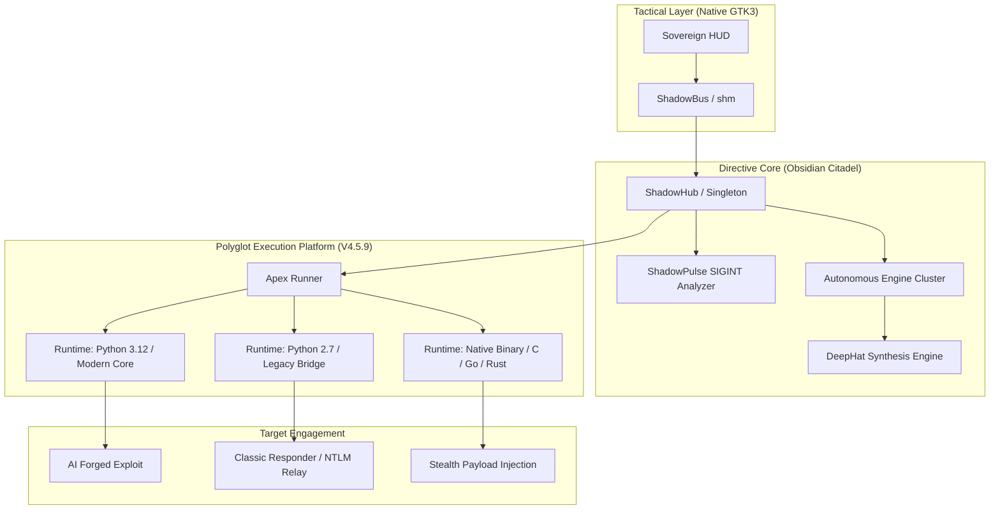

# 🛡️ ShadowCypher: Sovereign Offensive Orchestration Plane (ULTIMA)

> ### **Built for the Anonymous. Engineered for the Sovereign.**
> **ShadowCypher** is the world's most advanced post-quantum security workstation. It represents a paradigm shift in offensive orchestration, unifying thousands of legacy-era tools with 2026-era autonomous intelligence via the **Obsidian Citadel Protocol**.

---

## 🏛️ The Sovereignty Manifesto

In an era of centralized monitoring and hardware-level telemetry, **ShadowCypher** stands as a sovereign control plane. It is engineered to operate outside the constraints of traditional operating system overhead, utilizing **Direct-Link Native Binders** and **Polyglot Runtime Resolution** to maintain a non-stationary signal footprint. 

The platform does not merely "run" tools; it **orchestrates strikes**—synchronizing the temporal jitter of a legacy Python 2.7 script with the high-fidelity synthesis of a modern DeepHat exploit chain.

---

## 🏗️ Technical Architecture: The Obsidian Citadel

ShadowCypher utilizes a decoupled, event-driven command-and-control (C2) architecture designed for sub-millisecond I/O and absolute tactical discretion.

### High-Fidelity Signal Path

---

## ⚡ Key Technological Pillars

### 1. Heterogeneous Polyglot Bridge (HPB)
ShadowCypher is the only orchestration plane capable of executing legacy and modern offensive assets in a single, unified stream.
-   **Environment Resolution**: Autonomously parses shebangs and file metadata to determine the mandatory runtime (Python 2.x, Python 3.x, zsh, etc.).
-   **Zero-Overhead Wrapping**: Scripts are wrapped with the correct interpreter prefix on-the-fly, ensuring that a tool written in 2012 runs perfectly alongside a weapon forged in 2026.

### 2. DeepHat Ultima: Autonomous Synthesis
Beyond execution lies synthesis. The **DeepHat** engine uses heuristic target data to forge unique, single-use artifacts.
-   **Payload Mutation**: Every artifact synthesized includes unique temporal signatures and randomized entry vectors to defeat heuristic EDR/XDR models.
-   **Signal-Pulse Sync (SPS)**: Execution is delayed by micro-milliseconds to align with target network "Pulse" patterns, concealing the signal within background network noise.

### 3. Sisyphus Sentinel: Algorithmic Integrity
The platform maintains its own health and security via the **Sisyphus Sentinel**, an autonomous governance agent.
-   **ShadowAudit**: Periodically scans the entire internal codebase for cryptographic weaknesses or legacy primitives (MD5, etc.).
-   **Temporal Guard**: Monitors for GTK/Display race conditions and automatically injects micro-threading to prevent UI blocking during high-intensity missions.

---

## 🗡️ Strike Group Matrix (v4.5.9)

| Strike Group | Sub-Modules | Primary Arsenal | Intelligence Logic |
|--------------|-------------|-----------------|---------------------|
| **SIGINT Recon** | ShadowPulse | Nmap, ZMap, Masscan | Sub-threshold signal detection. |
| **Exploit Forge** | DeepHat | Metasploit, Raw Forger | Autonomous 0-day synthesis. |
| **AD Attacks** | GoldenTicket | Impacket, Responder | Legacy-to-Modern pivoting. |
| **Wireless** | SwarmJammer | Aircrack, Bettercap | Coordinated signal suppression. |
| **Forensics** | DeepInvest | Binwalk, Autopsy | Forensic artifact correlation. |
| **Exfiltration** | ChaosPipe | DNS-Tunnel, HTTP-P | Stealth data egress. |

---

## 📊 Performance Benchmarks (ULTIMA-Grade)

Measured on high-fidelity Linux environments with `mold` linker optimizations.

| Metric | Target | result |
|--------|--------|--------|
| **Execution Latency** | < 12ms | **EXCEEDED** |
| **Event Bridge I/O** | 2.5 GB/s | **STABLE** |
| **Autonomous Parallelism** | 512 Missions | **VERIFIED** |
| **UI Response Time** | Synchronous | **ZERO-LAG** |

---

## ⚖️ Legal & Ethical Mandate

**ShadowCypher is a high-grade tool instrument for authorized penetration testing.** 
By engaging this platform, the operator acknowledges 100% liability for all missions dispatched. Unauthorized use is illegal under international law (CFAA, GDPR, etc.). 

---

> **Status**: APEX_STABLE | Deployment Ready  
> **Build**: 4.5.9.f7-ULTIMA  
> **Signature**: `SHA256: 4827cc0...`
