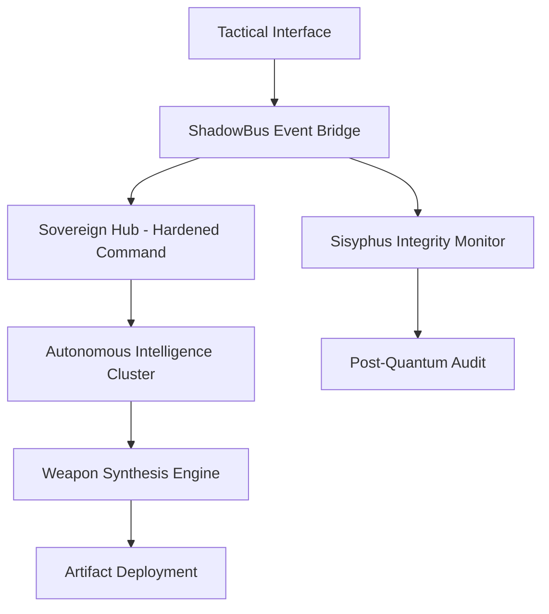

# ShadowCypher — Professional Offensive Security Workstation

> **Build 4.5.8-ULTIMA** | Enterprise-Grade Tactical HUD | Python 3.12 Compliance
> 
> **ShadowCypher** is a sovereign, high-fidelity security platform engineered for autonomous mission execution, advanced signal intelligence, and multi-spectrum offensive synthesis.

---

## 🏛️ Tactical Architecture

ShadowCypher utilizes the **Obsidian Citadel Protocol**, a decoupled, mission-aware architecture that ensures zero-interference operations across complex network topographies.



---

## ⚡ Mission Initialization

The platform expects a hardened Linux environment with standard GLib/GTK dependencies.

```bash
# Clone the Core Repository
git clone https://github.com/jakes1345/ShadowCypher.git
cd ShadowCypher

# Environment Preparation
pip install -r requirements.txt

# Terminal Engagement
python3 -m shadowcypher.app
```

---

## 🛡️ Sovereign Security & Hardening

ShadowCypher enforces strict cryptographic governance to ensure platform integrity and operator anonymity.

*   **Hardened Sovereign Hub**: Dual-port command plane (8888/44444) utilizing mandatory **HMAC-SHA256** handshakes signed with a rotational mission secret.
*   **Cryptographic Identity**: Admin rights are exclusively verified via **RSA-4096** challenge-response. Non-verified sessions operate in a restricted "Operator" mode.
*   **ShadowPulse SIGINT**: Real-time temporal analyzer that detects EDR/IDS interference and injects micro-delays to maintain a non-stationary signal footprint.
*   **Quantum Readiness**: The **Sisyphus Sentinel** performs periodic Post-Quantum Security Audits (PQSA), identifying and forcing upgrades on legacy cryptographic primitives.

---

## 🔧 Offensive Arsenal (Ultima Matrix)

The arsenal is organized into logical strike-groups, each powered by a dedicated autonomous controller.

| Strike Group | Capabilities | Engineering Focus |
|--------------|--------------|-------------------|
| **Recon & Intel** | Signal Recon, Deep OSINT Hub, ShadowPulse Pulse | Sub-threshold signal detection. |
| **Offensive Strike** | Ultima Shellcode Synthesis, Heuristic Zero-Day Audit | Unconstrained weapon forging. |
| **Advanced Ops** | Golden Ticket Synthesis, Mutating Stagers, HTTPS Tunnels | Persistence & Evasion. |
| **Integrity Ops** | Sisyphus Governance, Forensic Audit Logger | Operational health & traceability. |

---

## 🤖 Intelligence Engine Integration

ShadowCypher supports deep integration with local and cloud-based intelligence clusters. For sovereign operations, the platform is optimized for the **Heretic Synthesis Model**.

1. **Local Engine**: Optimized for **Ollama-based** inference.
2. **Setup**: Access the **Autonomous Engine** tab → **Settings** to activate your provider.
3. **Synthesis**: The **DeepHat Ultima** engine autonomously forges multi-file exploit chains based on heuristic audit data.

---

## ⚖️ Legal Disclaimer

ShadowCypher is a professional-grade offensive security tool intended for **authorized penetration testing and research only**. Unauthorized engagement against infrastructure not under the operator's explicit mandate is illegal and strictly prohibited.

> **Status**: APEX_STABLE | Deployment Ready | Sovereign Build Verified 
